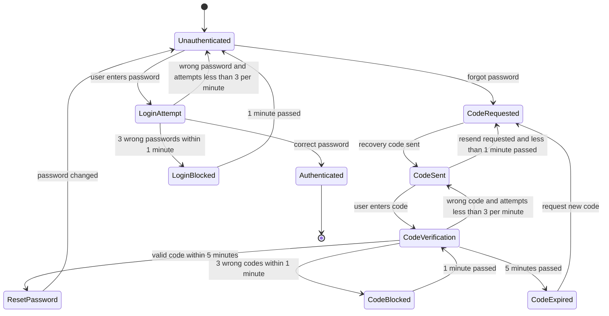

```mermaid
stateDiagram-v2

    [*] --> Unauthenticated

    Unauthenticated --> LoginAttempt : user enters password
    LoginAttempt --> Authenticated : correct password
    LoginAttempt --> Unauthenticated : wrong password and attempts less than 3 per minute
    LoginAttempt --> LoginBlocked : 3 wrong passwords within 1 minute

    LoginBlocked --> Unauthenticated : 1 minute passed

    Unauthenticated --> CodeRequested : forgot password

    CodeRequested --> CodeSent : recovery code sent
    CodeSent --> CodeRequested : resend requested and less than 1 minute passed

    CodeSent --> CodeVerification : user enters code

    CodeVerification --> ResetPassword : valid code within 5 minutes
    CodeVerification --> CodeSent : wrong code and attempts less than 3 per minute
    CodeVerification --> CodeBlocked : 3 wrong codes within 1 minute
    CodeVerification --> CodeExpired : 5 minutes passed

    CodeBlocked --> CodeVerification : 1 minute passed
    CodeExpired --> CodeRequested : request new code

    ResetPassword --> Unauthenticated : password changed

    Authenticated --> [*]
```