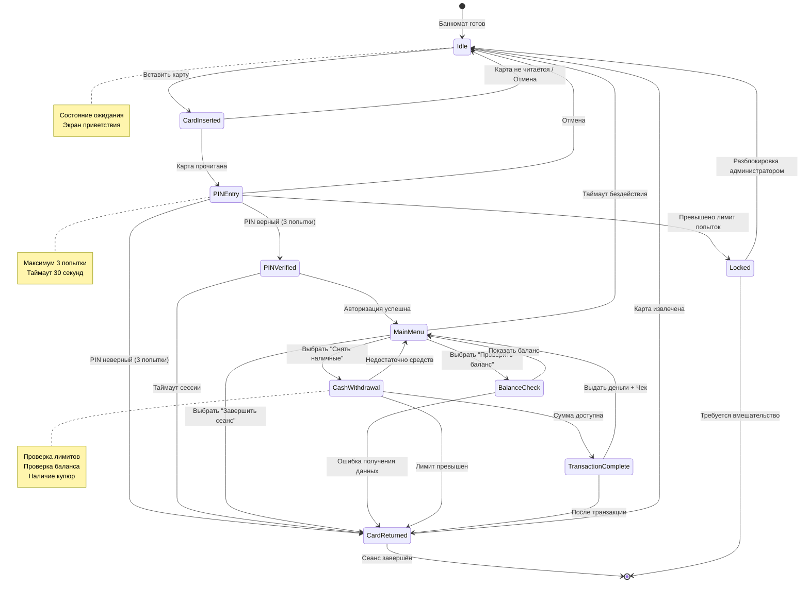

```mermaid
stateDiagram-v2
[*] --> Idle: Банкомат готов

    Idle --> CardInserted: Вставить карту
    CardInserted --> PINEntry: Карта прочитана
    CardInserted --> Idle: Карта не читается / Отмена

    PINEntry --> PINVerified: PIN верный (3 попытки)
    PINEntry --> CardReturned: PIN неверный (3 попытки)
    PINEntry --> Locked: Превышено лимит попыток
    PINEntry --> Idle: Отмена

    PINVerified --> MainMenu: Авторизация успешна
    PINVerified --> CardReturned: Таймаут сессии

    MainMenu --> BalanceCheck: Выбрать "Проверить баланс"
    MainMenu --> CashWithdrawal: Выбрать "Снять наличные"
    MainMenu --> CardReturned: Выбрать "Завершить сеанс"
    MainMenu --> Idle: Таймаут бездействия

    BalanceCheck --> MainMenu: Показать баланс
    BalanceCheck --> CardReturned: Ошибка получения данных

    CashWithdrawal --> TransactionComplete: Сумма доступна
    CashWithdrawal --> MainMenu: Недостаточно средств
    CashWithdrawal --> CardReturned: Лимит превышен

    TransactionComplete --> MainMenu: Выдать деньги + Чек
    TransactionComplete --> CardReturned: После транзакции

    CardReturned --> Idle: Карта извлечена
    Locked --> Idle: Разблокировка администратором

    CardReturned --> [*]: Сеанс завершён
    Locked --> [*]: Требуется вмешательство

    note right of Idle
        Состояние ожидания
        Экран приветствия
    end note

    note right of PINEntry
        Максимум 3 попытки
        Таймаут 30 секунд
    end note

    note right of CashWithdrawal
        Проверка лимитов
        Проверка баланса
        Наличие купюр
    end note
```